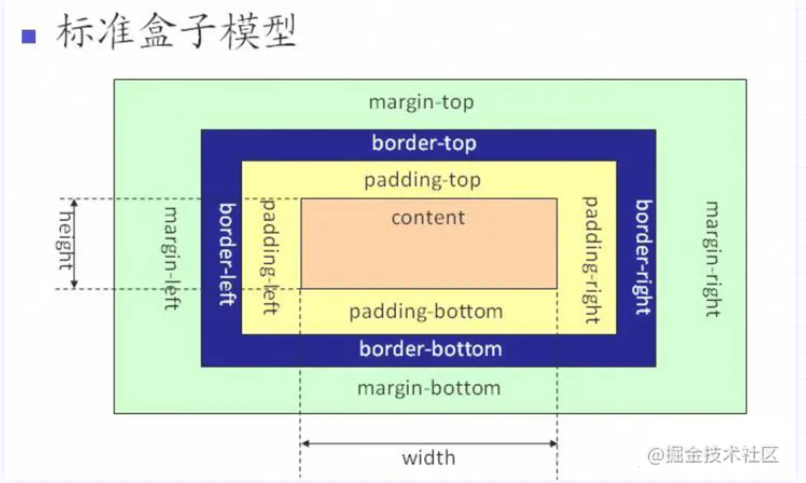
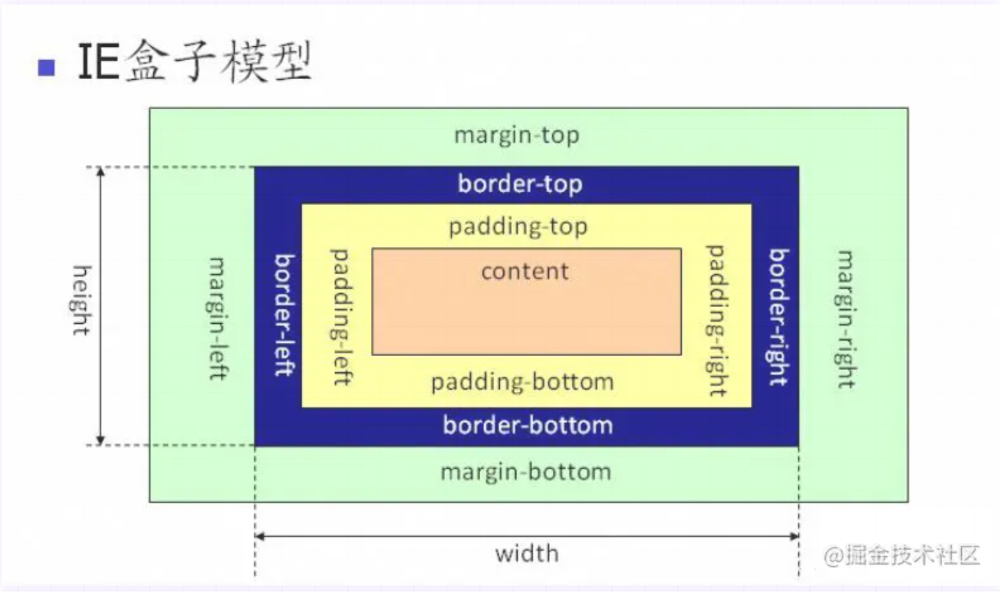

### 盒模型
### 如何改变盒模型的属性
### 标准盒模型 怪异盒模型

盒模型都是由四部分组成的，content，padding,border,margin  
标准盒模型和ie盒模型的区别在于设置width和height时的范围不同
- ie盒模型的范围为content+padding+border
- 标准盒模型的范围只为content
可以通过修改box-sizing的属性来修改盒模型
- `box-sizing:content-box`表示标准盒模型
- `box-sizing:border-box`表示IE盒模型(怪异盒模型)

### BFC
BFC (Block Formatting Context)块格式化上下文，是布局过程中生成块级盒子的范围，也是浮动和其他元素的交界范围  
通俗来讲：BFC是一个独立的布局环境，也可以理解为是一个容器，在这个容器中按照一定的规则进行物体的摆放，并且不会影响其他容器中的元素，如果一个元素触发BFC，则BFC中的元素不受外界的元素影响

#### 如何触发BFC
- 根元素Body
- 元素设置浮动：float除none以外的值
- 元素设置绝对定位：position:absolute
- display:inline-block,flex,table-cell
- overflow:hidden,auto,scroll

### js数据类型

### symbol BigInt

### null是基本数据类型还是复杂数据类型

### typeof null 为什么是object

### 为什么基本数据类型存在栈上，复杂数据类型存在堆上

### 栈跟堆在存储数据开辟内存的时候有什么区别

### 给一个未知类型的数据，计算机如果判断他应该存在栈还是堆

### 数据类型检测方式

### 为什么Object.prototype.toString.call可以判断数据类型

### 箭头函数和普通函数区别

### 箭头函数的argument对象

### js事件循环机制

### MutationObserver作用

### 手写Promise.all
