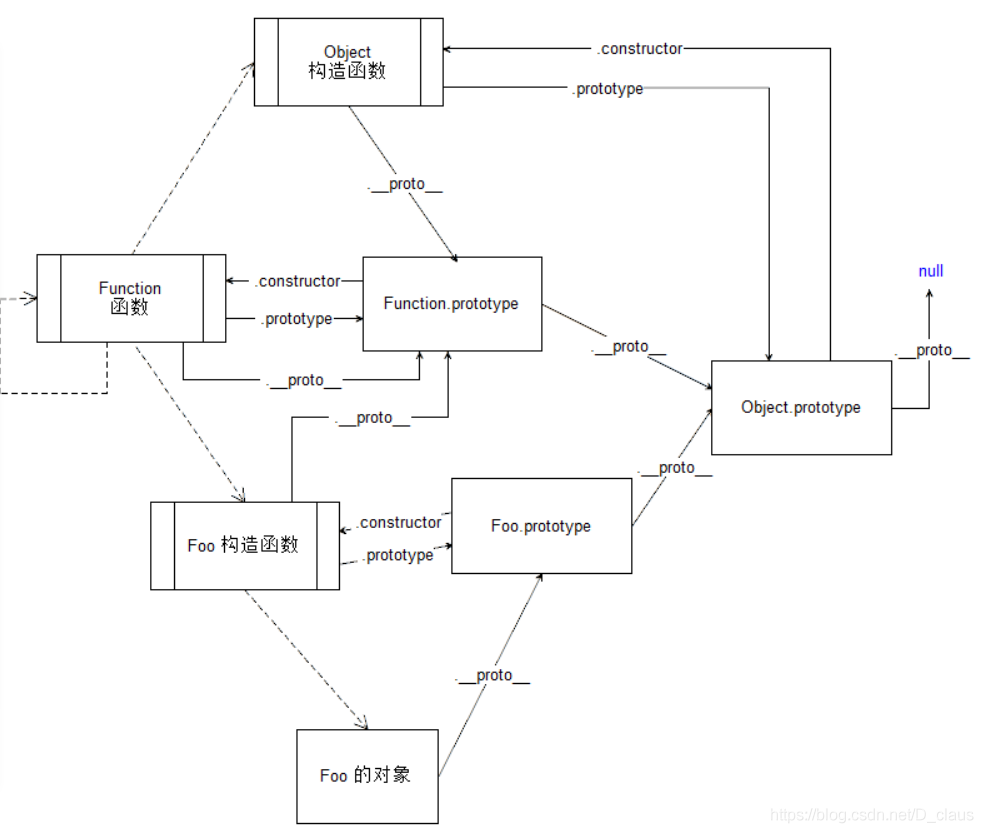

## 构造函数创建对象

使用构造函数创建一个对象

```js
function Person() {}
var person = new Person()
person.name = 'Kevin'
console.log(person.name) // Kevin
```

## prototype

每个函数都会有自己的 prototype 属性

```js
function Person() {}
// 虽然写在注释里，但是你要注意：
// prototype是函数才会有的属性
Person.prototype.name = 'Kevin'
var person1 = new Person()
var person2 = new Person()
console.log(person1.name) // Kevin
console.log(person2.name) // Kevin
```

函数的 prototype 指向一个对象，这个对象就是构造函数 new 出来的实例的原型

每一个 JavaScript 对象(null 除外)在创建的时候就会与之关联另一个对象，这个对象就是我们所说的原型，每一个对象都会从原型"继承"属性。


## \_\_proto\_\_

javascript 每个对象都有一个属性，\_\_proto\_\_,这个属性会指向该对象的原型

```js
function Person() {}
var person = new Person()
console.log(person.__proto__ === Person.prototype) // true
```


## constructor

每个原型都有 constructor 属性指向构造函数

```js
function Person() {}
console.log(Person === Person.prototype.constructor) // true
```


由此可得出结论

```js
function Person() {}

var person = new Person()

console.log(person.__proto__ == Person.prototype) // true
console.log(Person.prototype.constructor == Person) // true
// 顺便学习一个ES5的方法,可以获得对象的原型
console.log(Object.getPrototypeOf(person) === Person.prototype) // true
```

## 实例与原型

当实例读取属性时，如果找不到，就会去实例的原型上找，如果原型上还是找不到，就去原型的原型上去找，一直找到最顶层

```js
function Person() {}

Person.prototype.name = 'Kevin'

var person = new Person()

person.name = 'Daisy'
console.log(person.name) // Daisy

delete person.name
console.log(person.name) // Kevin
```

## 原型的原型

原型也是一个对象，因此原型也有自己的原型，原型是由 Object 构造函数创造的，因此原型的\_\_proto\_\_指向 Object 构造函数的原型


## 原型链

Object.prototype 的原型 `null`

```js
console.log(Object.prototype.__proto__ === null) // true
```

因此查找到 Object 的原型如果还不存在，就停止向上查找


## 关于 Function

所有的构造函数都是 Function 对象实例化出来的，因此，所有构造函数的\_\_proto\_\_指向 Function.prototype,Function 的\_\_proto\_\_和 prototype 都指向 Function.prototype,因此 Function.\_\_proto\_\_ === Function.prototype




## 补充

### constructor

```js
function Person() {}
var person = new Person()
console.log(person.constructor === Person) // true
```

当获取 person.constructor 时，其实 person 中并没有 constructor 属性,当不能读取到 constructor 属性时，会从 person 的原型也就是 Person.prototype 中读取，正好原型中有该属性，所以：

```js
person.constructor === Person.prototype.constructor //true
```

### \_\_proto\_\_

绝大部分浏览器都支持这个非标准的方法访问原型，然而它并不存在于 Person.prototype 中，实际上，它是来自于 Object.prototype ，与其说是一个属性，不如说是一个 getter/setter，当使用 obj.**proto** 时，可以理解成返回了 Object.getPrototypeOf(obj)。
